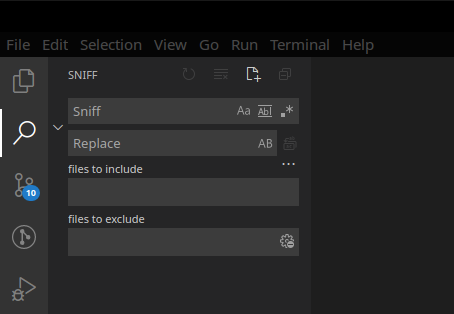
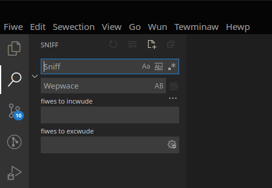
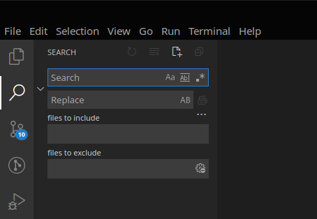

# Furry Language Pack for VS Code

Adds localization for Furry Language to VS Code :3

## What has been translated

This language pack contains 2 new Languages: `furry` and `furry-owo`.

### furry

Some words have been replaced with cuter ones. *Search* becomes *sniff*, *notification* becomes *boop*, and so on.



### furry-owo

Additonally, everything not replaced in the `furry` language *wiww wook wike this*.



### Original

This is the default language pack, for comparison.



## Usage

1. <kbd>Ctrl</kbd>+<kbd>Shift</kbd>+<kbd>p</kbd>
2. search for `Configure Display Language`
3. select `furry`

## Progress

So far, only the core editor has been translated. Some plugins may be translated in the future.

<!-- progress_table_start -->

| Language  | Scope       | Progress |
| --------- | ----------- | -------- |
| furry     | vscode core | ~4.97%   |
| furry-owo | vscode core | ~100%    |

<!-- progress_table_end -->

## Development

Launching Code with `--extensionDevelopmentPath` doesn't seem to work due to caching of translations. This workaround isn't ideal, but it does the job
¯\\\_(ツ)\_/¯

```bash
#!/bin/bash
npx vsce package
pkill code -9
code --uninstall-extension ./vscode-language-pack-furry-0.0.1.vsix
trash ~/.config/Code/clp # remove cached language packs
code --install-extension ./vscode-language-pack-furry-0.0.1.vsix
code . --locale=furry
```

## Credits

- [Original English translations](https://github.com/microsoft/vscode-loc/blob/master/i18n/vscode-language-pack-en-GB/translations/main.i18n.json) ([MIT license](https://github.com/microsoft/vscode-loc/blob/master/LICENSE.md))
- OwO-replacements (https://github.com/zuzak/owo)
